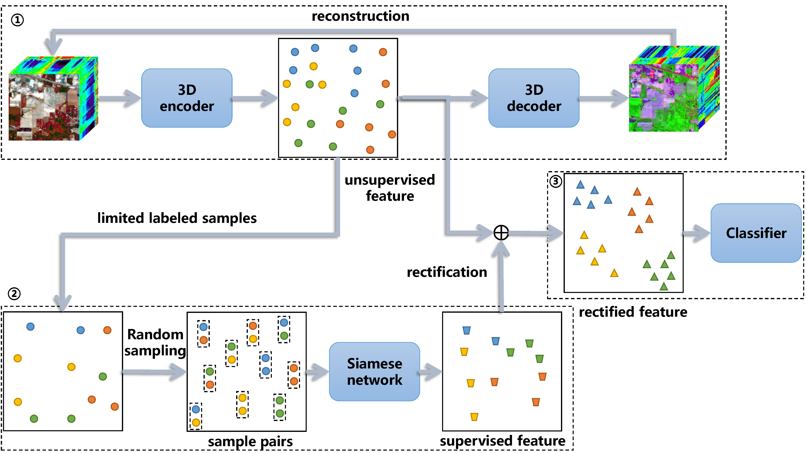

# 3DAES
## Abstract
With the development of hyperspectral imaging technology, hyperspectral images have become important when analyzing the class of ground objects. In recent years, benefiting from the massive labeled data, deep learning has achieved a series of breakthroughs in many fields of research. However, labeling hyperspectral images requires sufficient domain knowledge and is time-consuming and laborious. Thus, how to apply deep learning effectively to small labeled samples is an important topic of research in hyperspectral image classification.
To solve this problem, we propose a semi-supervised Siamese network that embeds Siamese network into semi-supervised learning scheme. It integrates an autoencoder module and a Siamese network to respectively investigate information in a large amount of unlabeled data and rectify it with a limited labeled sample set, which is called 3DAES.
First, the autoencoder method is trained on the massive unlabeled data to learn the refinement representation, creating an unsupervised feature. Second, based on this unsupervised feature, limited labeled samples are used to train a Siamese network to rectify the unsupervised feature to improve feature separability among various classes. Furthermore, by training the Siamese network, a random sampling scheme is used to accelerate training and avoid imbalance among various sample classes. Experiments on three benchmark hyperspectral image data sets consistently demonstrate the effectiveness and robustness of the proposed 3DAES approach with limited labeled samples. For study replication, the code developed for this study is available at https://github.com/ShuGuoJ/3DAES.git.

Figure 1. Flowchart of the proposed 3DAES architecture. In the first step, a 3D autoencoder is used to learn the HSI's structural information by exploiting a large amount of unlabeled data. In the next step, limited labeled samples composed of sample pairs are used to train the Siamese network with the unsupervised feature. Finally, the rectified feature is classified by logistic regression.

## Requirements
```
* pytorch
* scipy
* sklearn
* visdom
* numpy
```

## Usages
* Train Autoencoder
```
python TrainAutoencoder.py --name xxx --epoch xxx --gpu xxx
```
* Train SiameseNetwork
```
python TrainSiamese.py --name xxx --epoch xxx --gpu xxx
```

## BibTex
```
@ARTICLE{9565215,
  author={S. Jia and S. Jiang and Z. Lin and M. Xu and W. Sun and Q. Huang and J. Zhu and X. Jia},
  journal={IEEE Transactions on Geoscience and Remote Sensing}, 
  title={A Semisupervised Siamese Network for Hyperspectral Image Classification}, 
  year={2021},
  volume={},
  number={},
  pages={1-17},
  doi={10.1109/TGRS.2021.3116138}}
```
